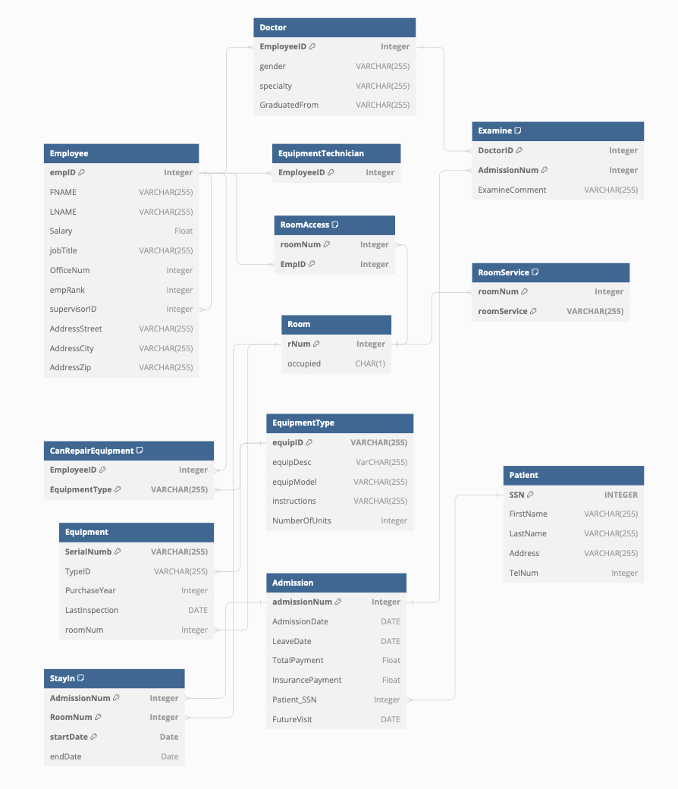
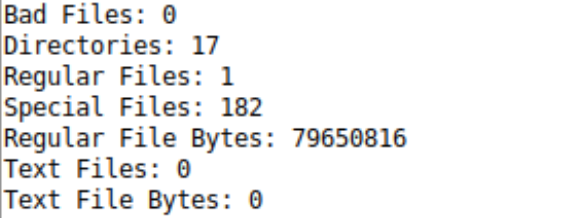

  

 

  
    

# About

- 📖: Worcester Polytechnic Institute, `WPI`
- 🎓: B.S. Computer Science *Expected:* `2026`
- 🧐: Intrested in `machine learning` and `cybersecurity`
- “”: `"The only source of knowledge is experience"` *- Albert Einstein*
- Currently `in pursuit of a Summer '24 Internship` in the Computer Science field
- Feel free to reachout to me via the Outlook badge above

# Recent Projects

---

## [Distributed John Conway's Game of Life](https://github.com/evlutz/Operating-Systems/tree/main/Distributed_Game_of_Life)

- `Synchronization` through `message passing`
- Optimized preformance with `multi-threading`
- Implemented `semaphores` for shared data `critical reigons`

**Check it out [HERE](https://github.com/evlutz/Operating-Systems/tree/main/Distributed_Game_of_Life)**

## [Hospital Information System](https://github.com/evlutz/Databases/tree/main/Hospital%20Information%20System%20(MIS))

 * Utilizes a `Normalized Entity Relationship Database (ERDB)` to provide information about Managers, Different Employees, Patients, Visits, Equipment, Rooms, Room Services and Financials
 * The Database includes common `views`, `queries`, and `triggers` to avoid redundancy and ensure the database is concise as well as ensure necessary data is expected such as high risk patients
 * Information from the database can be pulled through an included `Java Database Connectivity (JDBC)` which can be altered to fit the users exact needs
 * The Database was created using Oracle's `SQLDeveloper` and is compatible with other `SQL` clients

#### Entity-Relationship Diagram (ERD)

**Check it out [HERE](https://github.com/evlutz/Databases/tree/main/Hospital%20Information%20System%20(MIS))**

## [Multiserver](https://github.com/evlutz/Operating-Systems/tree/main/Server%20Request%20Handler)

- `Serial and Multi-Threaded` architecture available
- Replicates a server which all thread at some point havee to access the critical reigon
- Implements `mutual exclusion` in the critical reigon
- Utilizes `iNode` information but also checks specifically for text files

**Check it out [HERE](https://github.com/evlutz/Operating-Systems/tree/main/Server%20Request%20Handler)**

---

# Languages:

    
  </a>
    
    </a>
    
  </a>
    
  </a>
    
  </a>
    
  </a>
    
  </a>

# Software

    
  </a>
    
  </a>
    
  </a>
    
  </a>
    
  </a>
    
  </a>
    
  </a>
    
  </a>
    
  </a>
    
  </a>
    
  </a>
    
  </a>
    
  </a>

<!--

**evlutz/evlutz** is a ✨ _special_ ✨ repository because its `README.md` (this file) appears on your GitHub profile.

Here are some ideas to get you started:

- 🔭 I’m currently working on ...
- 🌱 I’m currently learning ...
- 👯 I’m looking to collaborate on ...
- 🤔 I’m looking for help with ...
- 💬 Ask me about ...
- 📫 How to reach me: ...
- 😄 Pronouns: ...
- ⚡ Fun fact: ...
-->
